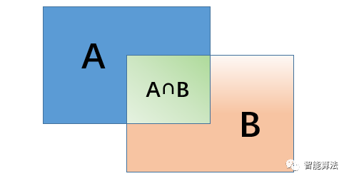
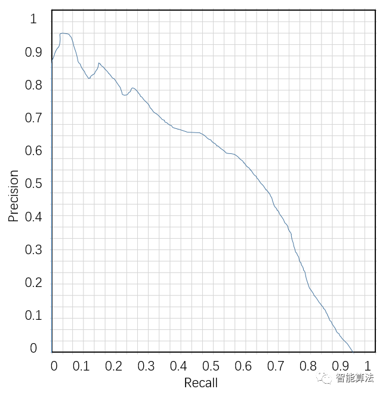
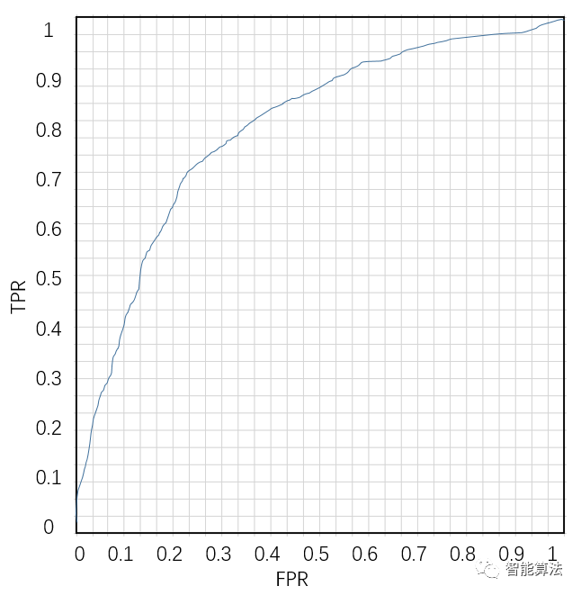
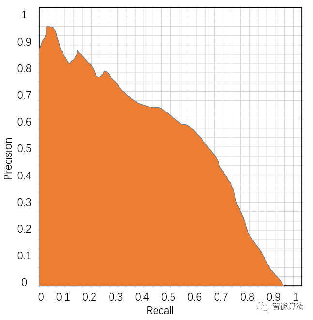
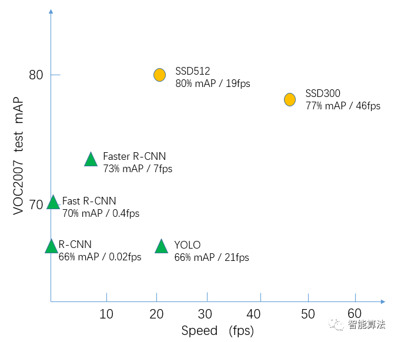
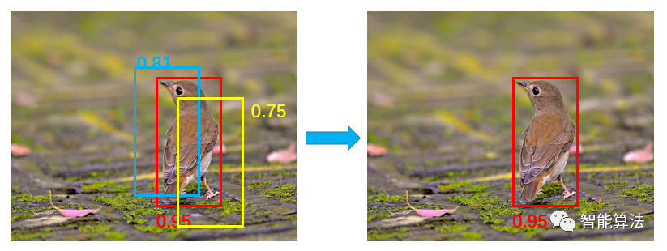
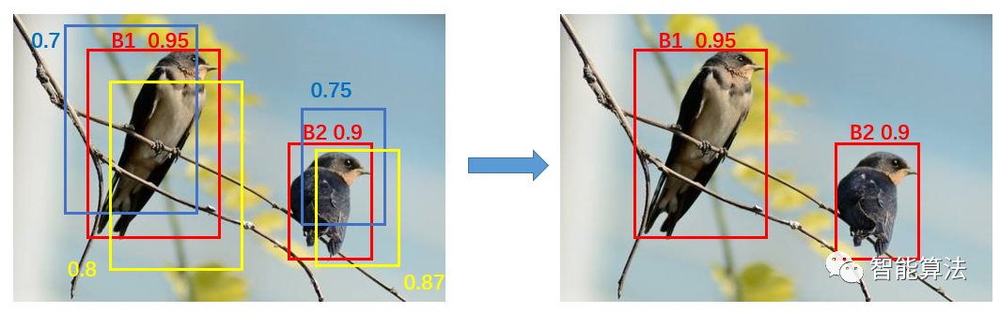

目标检测由于涉及到多个子任务：定位，分类。故其评价方法较为复杂，本章从交并比，准确率，精度，召回率，FPR, F1-Score, PR曲线，ROC曲线，AP的值，AUC的值以及很重要的mAP指标，模型的检测速度和非极大值抑制的相关方面来学习下目标检测中的评价指标。

### 交并比 — IoU

交并比IoU是英文intersection over union的简写，意思是检测结果的矩形框与样本标注的矩形框的交集与并集的比值。如下图：

上图中假设A为模型的检测结果，B为Ground Truth即样本的标注结果，那么A与B相交的区域即为A∩B，而A与B的并集即为AB共有的区域A∪B,那么IoU的计算公式即为:  IoU = (A∩B) / (A∪B) 

一般情况下对于检测框的判定都会存在一个阈值，也就是IoU的阈值，一般可以设置当IoU的值大于0.5的时候，则可认为检测到目标物体。

### 准确率/精度/召回率/FPR/F1指标

以上五个指标都离不开下列定义：

* 预测值为正例，记为P（Positive）
* 预测值为反例，记为N（Negative）
* 预测值与真实值相同，记为T（True）
* 预测值与真实值相反，记为F（False）

# 准确率

准确率accuracy是我们最常见的评价指标，这个很容易理解，就是被分对的样本数除以所有的样本数，通常来说，正确率越高，分类器越好，如下：

        accuracy = (TP+TN)/(TP+TN+FP+FN)

上公式中的TP+TN即为所有的正确预测为正样本的数据与正确预测为负样本的数据的总和，TP+TN+FP+FN即为总样本的个数。

# 精度

精度precision是从预测结果的角度来统计的，是说预测为正样本的数据中，有多少个是真正的正样本，即“找的对”的比例，如下：

         precision = TP/( TP+FP)

上公式中的TP+FP即为所有的预测为正样本的数据，TP即为预测正确的正样本个数。

# 召回率/TPR

召回率recall和TPR(灵敏度(true positive rate))是一个概念，都是从真实的样本集来统计的，是说在总的正样本中，模型找回了多少个正样本，即“找的全”的比例，如下：

         recall/TPR  = TP/(TP+FN)

上公式中的TP+FN即为所有真正为正样本的数据，而TP为预测正确的正样本个数。

# FPR

FPR(false positive rate)，它是指实际负例中，错误的判断为正例的比例，这个值往往越小越好，如下：

         FPR = FP/(FP+TN)

其中，FP+TN即为实际样本中所有负样本的总和，而FP则是指判断为正样本的负样本。

# F1-Score

F1分数(F1-score)是分类问题的一个衡量指标。F1分数认为召回率和精度同等重要, 一些多分类问题的机器学习竞赛，常常将F1-score作为最终测评的方法。它是精确率和召回率的调和平均数，最大为1，最小为0。计算公式如下：

         F1 = 2TP/(2TP+FP+FN)

此外还有F2分数和F0.5分数。F2分数认为召回率的重要程度是精度的2倍，而F0.5分数认为召回率的重要程度是精度的一半。计算公式为：

更一般地，我们可以定义Fc（precision和recall权重可调的F1 score）:

        Fc = ((1+c*c)*precision*recall) / (c*c*precision + recall)

### PR曲线—AP值/ROC曲线-AUC值

上面学习了关于精度，召回率，FPR，和F1-Score的知识，但是通常，只有那些往往不能够直观的反应模型性能，所以就有了PR曲线，ROC曲线，AUC值。

# PR曲线和AP的值

PR曲线，就是precision和recall的曲线，PR曲线中precision为纵坐标，recall为横坐标,如下图：

* 评估能力

那么PR曲线如何评估模型的性能呢？从图上理解，如果模型的精度越高，召回率越高，那么模型的性能越好。也就是说PR曲线下面的面积越大，模型的性能越好。绘制的时候也是设定不同的分类阈值来获得对应的坐标，从而画出曲线。

* 优缺点

PR曲线反映了分类器对正例的识别准确程度和对正例的覆盖能力之间的权衡。

PR曲线有一个缺点就是会受到正负样本比例的影响。比如当负样本增加10倍后，在racall不变的情况下，必然召回了更多的负样本，所以精度就会大幅下降，所以PR曲线对正负样本分布比较敏感。对于不同正负样本比例的测试集，PR曲线的变化就会非常大。

* 平均准确率AP

AP即Average Precision，称为平均准确率，是对不同召回率点上的准确率进行平均，在PR曲线图上表现为PR曲线下面的面积。AP的值越大，则说明模型的平均准确率越高。

# ROC曲线和AUC值

ROC的全称是Receiver Operating Characteristic Curve，中文名字叫“受试者工作特征曲线”，对于ROC来说，横坐标就是FPR，而纵坐标就是TPR，因此可以想见，当TPR越大，而FPR越小时，说明分类结果是较好的。如下图：

* 优缺点

ROC曲线有个很好的特性，当测试集中的正负样本的分布变换的时候，ROC曲线能够保持不变。

ROC曲线可以反映二分类器的总体分类性能，但是无法直接从图中识别出分类最好的阈值，事实上最好的阈值也是视具体的场景所定。ROC曲线一定在y=x之上，否则就是一个不好的分类器。

* AUC

AUC是Area under curve的首字母缩写，即ROC曲线下的面积，介于0和1之间。计算方式即为ROC曲线的微积分值，其物理意义可以表示为：随机给定一正一负两个样本，将正样本排在负样本之前的概率，因此AUC越大，说明正样本越有可能被排在负样本之前，即正样本分类结果越好。

### 平均精度均值 — mAP

mAP是英文mean average precision的缩写，意思是平均精度均值，这个词听起来有些拗口，我们来仔细捋一捋。上面我们知道了什么是AP，AP就是PR曲线下面的面积（如下图），是指不同召回率下的精度的平均值。

然而，在目标检测中，一个模型通常会检测很多种物体，那么每一类都能绘制一个PR曲线，进而计算出一个AP值。那么多个类别的AP值的平均就是mAP

mAP衡量的是学出的模型在所有类别上的好坏，是目标检测中一个最为重要的指标，一般看论文或者评估一个目标检测模型，都会看这个值，这个值是在0-1直接，越大越好。

一般来说mAP针对整个数据集而言的，AP针对数据集中某一个类别而言的，而percision和recall针对单张图片某一类别的。

### 模型的检测速度

检测速度，这个很好理解，简单的说就是一秒钟能够检测多少张图片。不同的目标检测技术往往会有不同的mAP和检测速度，如下图（后面我们将逐一学习）：

目标检测技术的很多实际应用在准确度和速度上都有很高的要求，如果不计速度性能指标，只注重准确度表现的突破，但其代价是更高的计算复杂度和更多内存需求，对于全面行业部署而言，可扩展性仍是一个悬而未决的问题。

在实际问题中，通常需要综合考虑mAP和检测速度等因素。

### 非极大值抑制（NMS）

非极大值抑制虽然一般不作评价指标，但是也是目标检测中一个很重要的步骤，因为下期就要步入经典模型的介绍了，所以这里随着评价指标简单介绍下。

* 单个预测目标

NMS的英文为Non-Maximum Suppression,就是在预测的结果框和相应的置信度中找到置信度比较高的bounding box。对于有重叠在一起的预测框，如果和当前最高分的候选框重叠面积IoU大于一定的阈值的时候，就将其删除，而只保留得分最高的那个。如下图：

* 计算步骤：

1). NMS计算出每一个bounding box的面积，然后根据置信度进行排序，把置信度最大的bounding box作为队列中首个要比较的对象；

2). 计算其余bounding box与当前最大score的IoU，去除IoU大于设定的阈值的bounding box，保留小的IoU预测框；

3). 然后重复上面的过程，直至候选bounding box为空。

* 多个预测目标

当存在多目标预测时，如下图，先选取置信度最大的候选框B1，然后根据IoU阈值来去除B1候选框周围的框。然后再选取置信度第二大的候选框B2,再根据IoU阈值去掉B2候选框周围的框。

