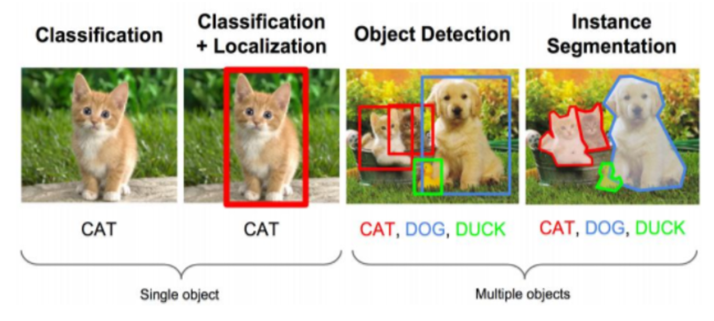

## 目标检测

目标检测（Object Detection）是计算机视觉领域的基本任务之一，学术界已有将近二十年的研究历史。近些年随着深度学习技术的火热发展，目标检测算法也从基于手工特征的传统算法转向了基于深度神经网络的检测技术。该任务旨在提取出图片中的目标位置以及目标类别。

## 商超场景下的目标检测
而商超场景下的目标检测面临诸多挑战：品类繁多，标注困难；目标密集，检测困难；上新速度快，模型迭代困难。
在该场景下，本方案旨在挖掘传统目标检测框架和小样本目标检测框架的潜力，充分对比两者的优劣并给出应用建议。
