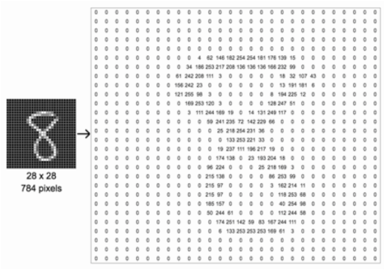
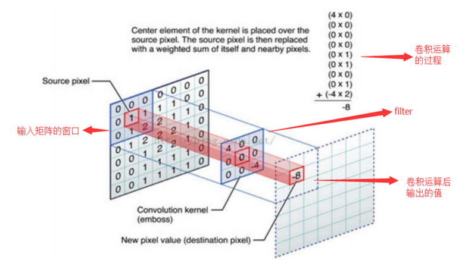
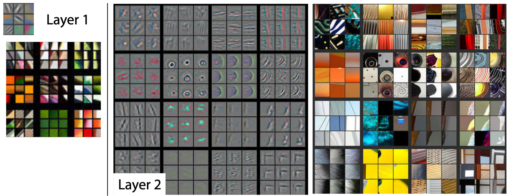
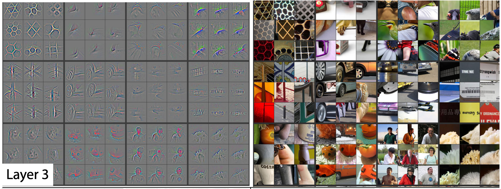
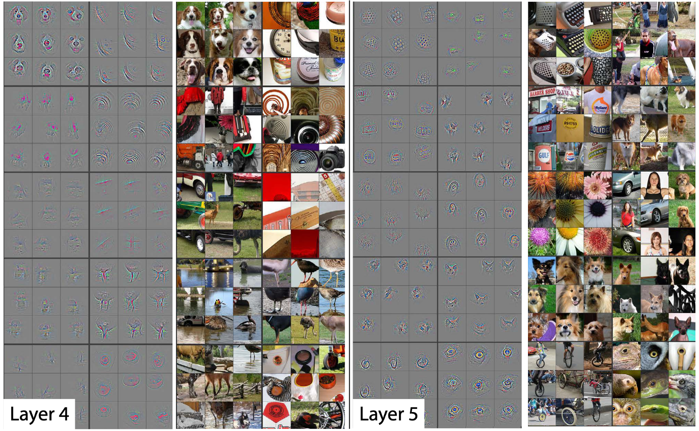

### 卷积神经网络基础

**计算机眼中的图像**：

**单层卷积操作**：

**卷积神经网络(Convolutional Neural Network, CNN)**：

### 通过可视化理解卷积神经网络

**浅层卷积核以及特征图可视化**：底层卷积层的卷积核负责提取低级特征：如颜色，纹理等等

**层数加深，特征不断精细化**：

**深层卷积核以及特征图可视化**：最终高层卷积核所对应的特征十分具体且方便分类

CNN学习到的特征呈现分层特性，底层是一些边缘角点以及颜色的抽象特征，越到高层则越呈现出具体的特征，这一过程正与人类视觉系统类似。故更多的模型向更深的卷积层发展，这也是深度学习的“深”的确切含义

