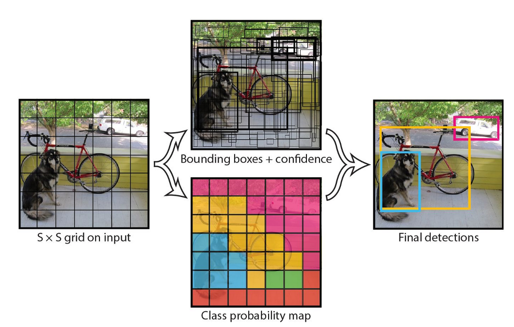
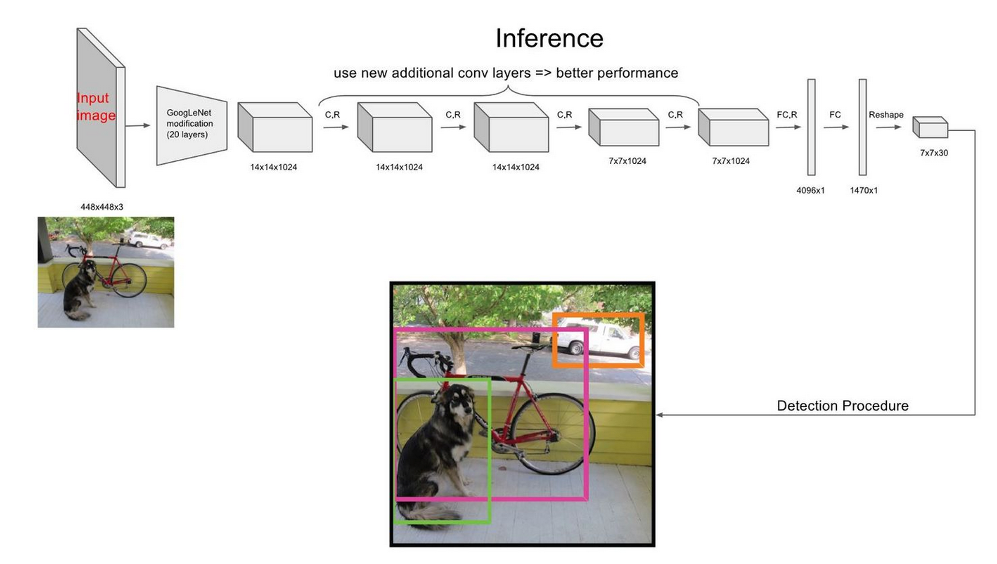

YOLO 是“You only look once”的首字母缩写，是一种将图像划分为网格系统的对象检测算法。网格中的每个单元格负责检测自身内部的对象。由于其速度和准确性，YOLO 是最著名的物体检测算法之一。

## 模型架构
YOLO是一个标准的One-Stage目标检测架构，其全称是：You only look once。经过多年的迭代目前已经发布V5版本，起性能和速度均达到业界顶尖水平。

最终预测结果构成为SxS个向量：（类别，置信度，bbox），而后通过后处理算法（NMS）以保留部分结果。

## 模型表现

YOLOv5在COCO数据集上的结果同之前的SOTA对比：在所有速度和mAP上均得到了SOTA的性能表现。

## reference

* paper： https://www.cv-foundation.org/openaccess/content_cvpr_2016/html/Redmon_You_Only_Look_CVPR_2016_paper.html
* source code：https://github.com/ultralytics/yolov5

Redmon J, Divvala S, Girshick R, et al. You only look once: Unified, real-time object detection[C]//Proceedings of the IEEE conference on computer vision and pattern recognition. 2016: 779-788.

