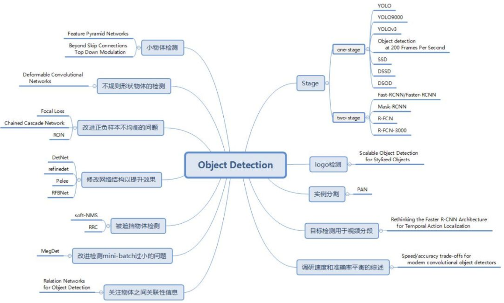

## 使用场景

根据生成检测框方法不同可以分为Anchor Free方法和Anchor Based方法，而Anchor Based又可以进一步分为One-Stage方法和Two-Stage方法。

* One-Stage：Yolo、SSD、RetinaNet。
* Two-Stage：RCNN、Faster RCNN、FPN。  

随着2012年AlexNet的出现，越来越多的领域被深度学习屠榜，而目标检测这个停滞多年的视觉领域也重新焕发的活力。目标检测的研究成果在计算机视觉三大顶会（CVPR/ICCV/ECCV）的占比也逐年增加。

本workshop主要覆盖以下几个算法，对比结果如下
* Pegasus
* BART
