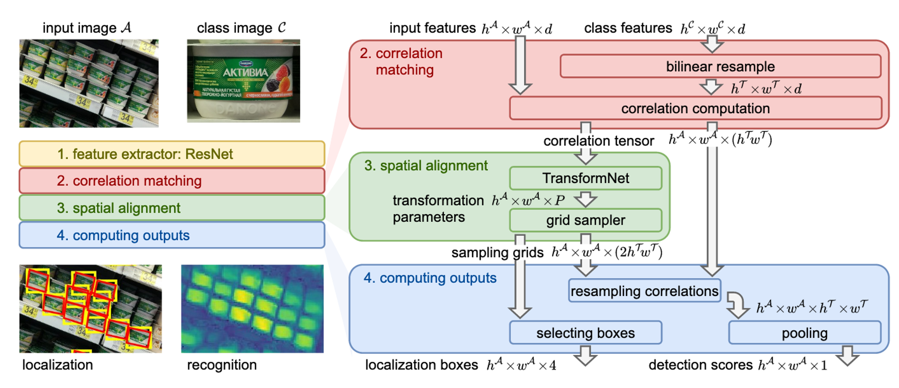
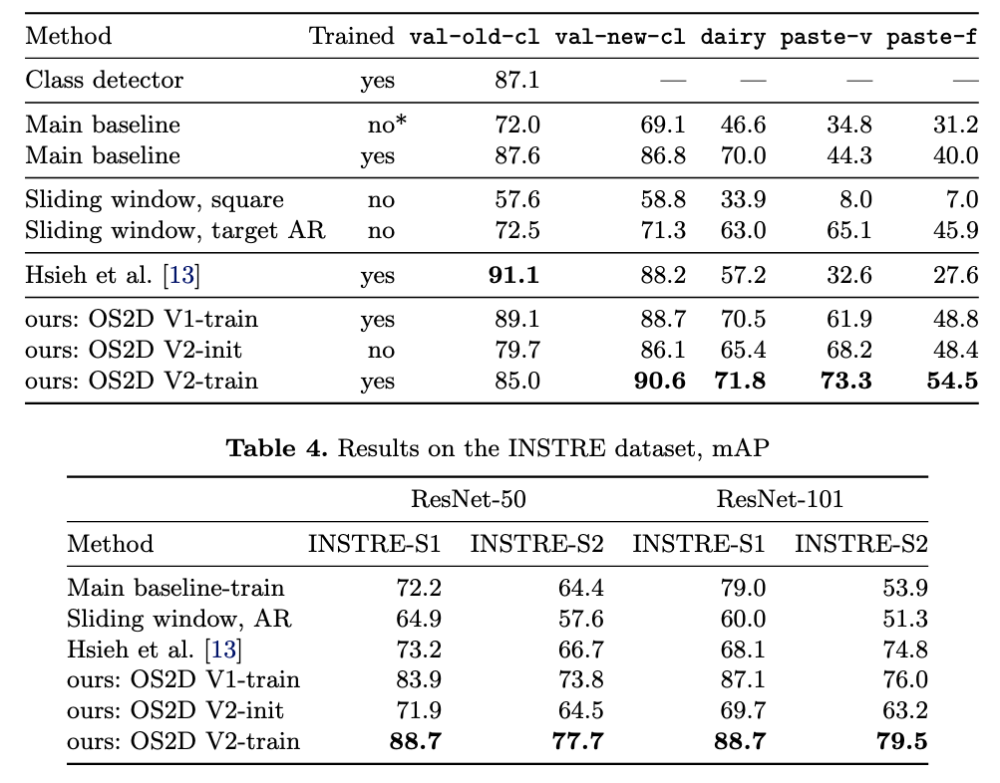

OS2D: One-Stage One-Shot Object Detection by Matching Anchor Features,一种仅需要一张标注图像即可实现目标检测的模型，在完全不在客户数据集funeturn的情况下达到近乎完美的效果。

PS：需要特定的光照，拍摄距离以及拍摄角度才能达到与YOLO媲美的性能

## 模型架构
Os2d是基于One-shot Learning的One-Stage目标检测算法，其中心思想类似于以图搜图，只不过在这里以图搜图换成了以特征搜特征。其模型主要分为四个模块：
* 特征提取模块：通过ResNet作为backbone对类别图像和输入图像分别进行特征编码得到两组feature map。
* 特征匹配模块：将第一步提出的两组feature在特征空间上计算相似度，得到相似度特征矩阵。
* 空域增强模块：通过TransformNet对相似度特征矩阵生成仿射变换参数，以适应图像失真以及不同角度带来的形变问题。
* 目标检测模块：协同相似度特征矩阵和仿射变换参数矩阵生成最终的检测结果（检测框位置+置信度+类别）。

## 模型表现

模型在各种数据集划分下的表现：测试集中的目标没有在训练集里出现过，可以认为是另一种程度上的zero-shot。

## reference

* paper： https://arxiv.org/abs/2003.06800
* source code：https://github.com/aosokin/os2d

 Osokin A , Sumin D , Lomakin V . OS2D: One-Stage One-Shot Object Detection by Matching Anchor Features[J]. ECCV 2020.

